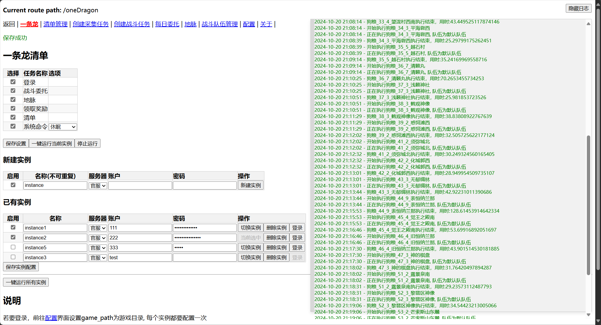
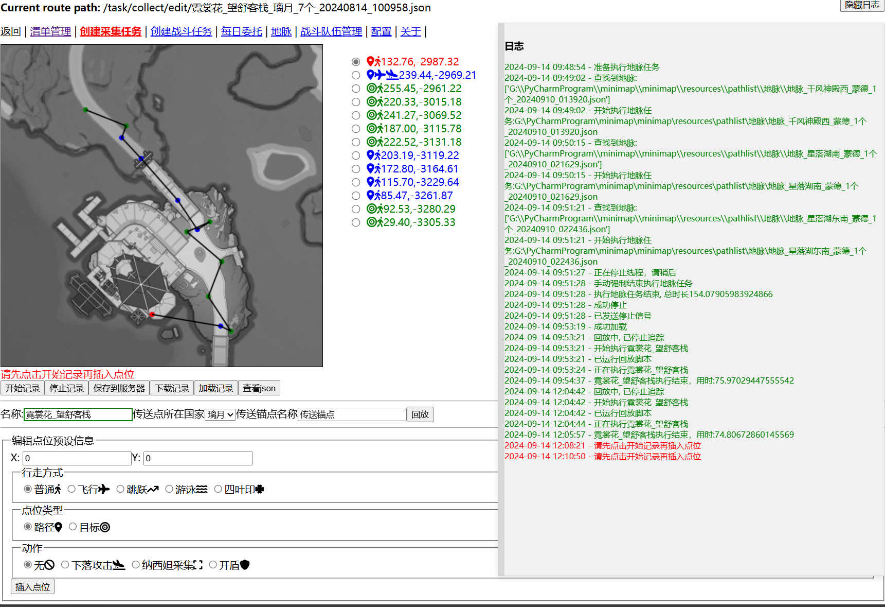
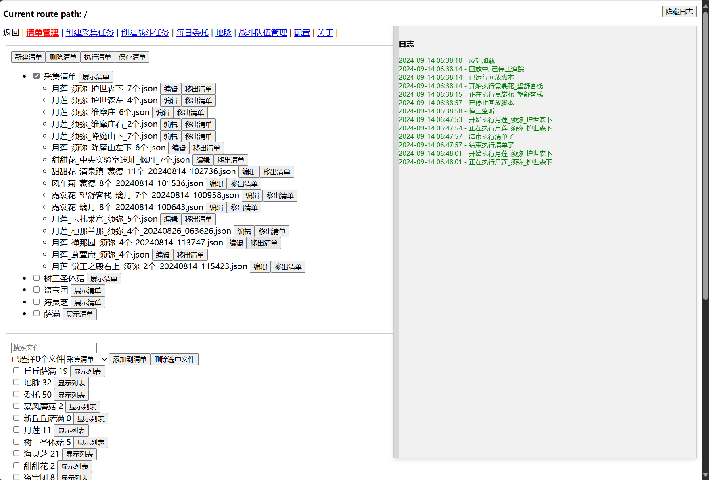
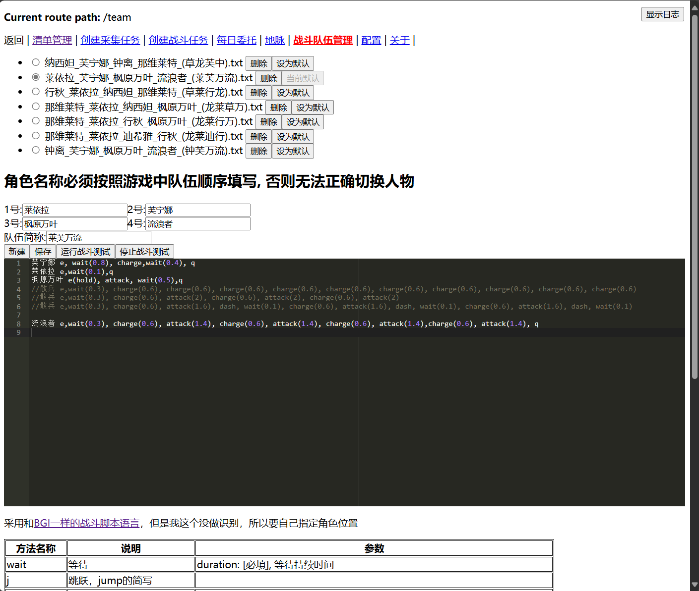

# MiniMap-GUI
后端项目: https://github.com/tignioj/minimap

## 一条龙


## 路径记录与回放



## 清单管理



## 战斗队伍管理



## 通过flask部署
获取资源方式： 
### 方式1
直接下载编译后的分支 https://github.com/tignioj/minimap-gui/tree/flask-deploy
### 方式2：通过git submodule
添加子模块
```
git submodule add https://github.com/tignioj/minimap-gui/tree/flask-deploy server/web
```

获取子模块数据
```
git submodule update --recursive --init --force
```


## 目录结构
```text
project
    |server
        |MinimapServer.py
        |web
            |templates
                |index.html
            |static
                |xxx.css
                |xxx.js
```

MinimapServer.py
```python
import flask
app = Flask(__name__,
            static_folder='web/static',
            template_folder='web/templates')
app.run(host=host, port=5000)
```
